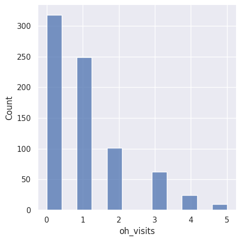
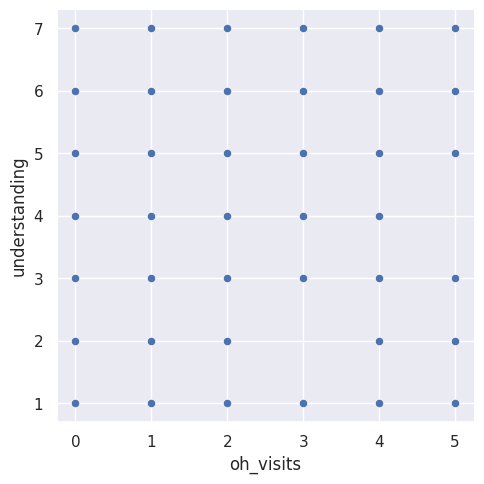
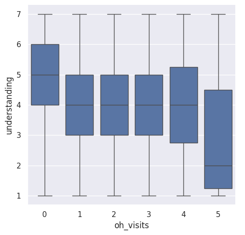
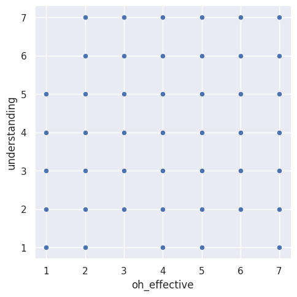
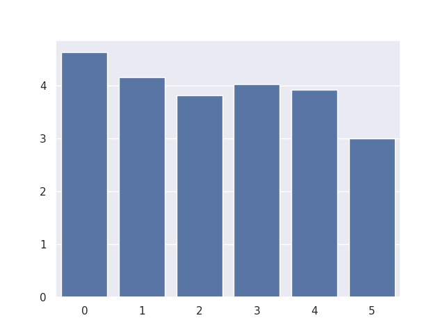

---
# Do not edit the text between these lines!
layout: default
---

# COMP110 Final Exercise Project!

<!-- This is a comment. Below, you'll see code for inserting an image. To make this image appear, update <custom-path>. To add an image, save it inside the imgs folder of this repository. -->

## Project Overview

During this project, I analyzed surveyed data across all of the sections of COMP110 students this semester. My goal was to see how we can improve the course design. I investigated whether atttending office hours is associated with increased student understanding. 

To conduct the analysis, I combined the two data sets, specifically survey_izzi.csv and survey_alyssa.csv into a single data set. Then I isolated the specific variables I needed for my analysis includign: 
a. office hour visits ('oh_visits')
b. office hour effectiveness ('oh_effective')
c. student understanding ('understanding')

I used my own helper functions to clean the ata by removing missing responses. I also converted data to numerical forms. I generated visualizations to explore the data. 

# Visualizations

## Distribution of Office Hour Visits

This graph shows how frequently students attended office hours. 

## Office Hour visits vs Understanding

This scatterplot shows if attending office hours is related to higher understanding.

## Understanding per Office Hour Visits

This boxplot shows a comparison of understanding of the students per the different levels of office hour attendance. 

## Office Hour effectiveness vs understanding

This visualization shows if students who found the office hours they attended helpful is related to them showing a higher level of understanding. 

## Average Understanding by Visits to Office Hours

This shows the average understanding for each of the levels of office hour visits. 

# Conclusion

 The results of my analysis did not show strong or consistent relationshjips between office hour attendance and student understanding. The visualizations showed no real trend, as you can see above, disproving my theory that studnets who attended office hours regularly had a higher understanding. The relationship between effectiveness of the office hours and understanding also didn't have a pattern.

These suggest that with the available data, attending office hours is not a strong predictor alone of student understanding in COMP110. But this could be influenced by limitations in the data set, like many students didn't attend office hours which can mislead the data or lead to missing data. It also doesn't show how studnets used the office hours they did attend. 

I recommend increasing office hour avaialbilty and encouraging the students to attend. It can provide support that students need, that this dataset was unable to capture. 

However, expanding office hours would require additional resources like time from the professors and TA's, which is no small feat. Also, even with increased office hour availability, more students might not attend or find it beneficital. Just because there are more opportunities doesn't mean students will take them. 

Future data should focus on aspects of office hour usage. This can be why students attended, what questions hey asked, and how helpful they found the overall encounter. This might let my data set become more specific into how office hours helped students or why they were not finding them as helful. 

Overall, even though the data was inconclusive, I think OH are a valuable resource. More data in the survey is needed to assess any relationship between student understanding, office hour effectiveness, and overall office hour attendance. 